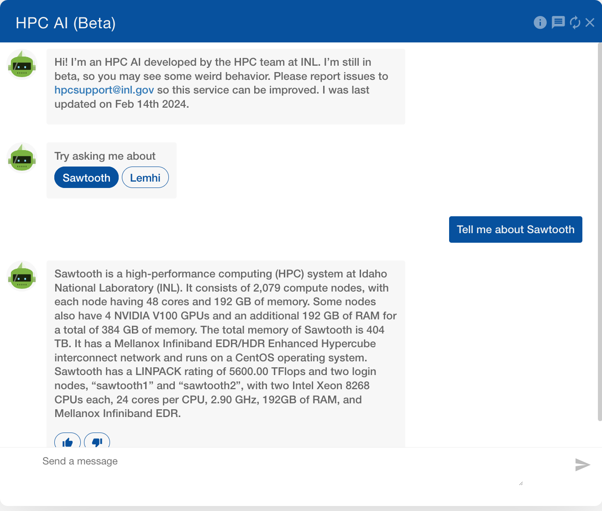

# Open OnDemand Chatbot
This is a frontend only, OpenAI API streaming/RAG compatible, chat interface for Open OnDemand. This is meant to be as minimally invasive to the primary web app as possible. This does present security challenges as API keys would be exposed in the public javascript. To prevent this, I recommend setting up a gateway that interacts with your LLM/RAG API but can filter access.

To learn more about this, email brandon.biggs@inl.gov or read our paper - https://www.osti.gov/biblio/2352719

## Setting this up in your environment
The only configuration options that absolutely need to be changed are at the top of `index.js`. This is where you can set the prompt, support email, URLs, etc. Go through the top of this file and configure this for your environment.

There are 3 files needed: `index.html`, `index.css`, `index.js`.

OnDemand 3.1 introduces [custom javascript files](https://osc.github.io/ood-documentation/latest/release-notes/v3.1-release-notes.html?highlight=custom_javascript_files#custom-javascript-files), so this becomes much easier. You will want to add something like the following to `/etc/ood/config/ondemand.d/ondemand.yml`
```yml
custom_javascript_files: ["chat.js"]
custom_css_files: ["chat.css"]
```

### index.html
This is the base html that shows the chat popup and text window.

The contents of `index.html` should go into `/var/www/ood/apps/sys/dashboard/app/views/layouts/_chat.html.erb`. Once that file has been created, add `<%= render "layouts/chat" %>` to the bottom of `/var/www/ood/apps/sys/dashboard/app/views/layouts/application.html.erb` right before footer.

It should look like this:

```html
  </div><!-- /.container -->
  <%= render "layouts/chat" %>
  <%= render "layouts/footer" %>
</body>
```

### index.css
To work with the custom css files configuration option that OOD 3.1 provides, you can put `index.css` in this location: `/var/www/ood/public/chat.css`

### index.js
To work with the custom javascript files configuration option that OOD 3.1 provides, you can put `index.js` in this location: `/var/www/ood/public/chat.js`

## Large Language Model
This is compatible with OpenAI API endpoints. This means that you *should* be able to point it at the main OpenAI API for LLM generation, however, I have not tested that. I had my own API running with local large language models. This was done using different libraries outside of the scope of this repository. 

The endpoints that are used are:
```
/                       # Checking if the API is reachable
/chat/completions       # Communicate with the generation API
```

There are a few additional endpoints that were setup for feedback. These are not needed. Those endpoints are:
```
/message_feedback       # Provides feedback on a given message
/feedback               # Provide general feedback via an HTML form
```

## Vector Database
This was a custom endpoint that was setup to support retrieval augmented generation. This is also not needed but will drastically improve the results of your llm.
```
/search_vdb             # Search vector database
```

## Known Bugs
- Smaller size screens don't scale very well. Conversely, if the screen is too big there are some transparency issues with the bottom of the chat box
- Sometimes the LLM gets stuck in a huge never ending loop? LLM side seems to work fine with streaming so probably an issue on JS

## Future Improvements
- Get the little chat icon to not continue past page footer
- When fullscreening the app, don't let it continue past nav bar
- Fix the issues with bigger/smaller screens

## Example


